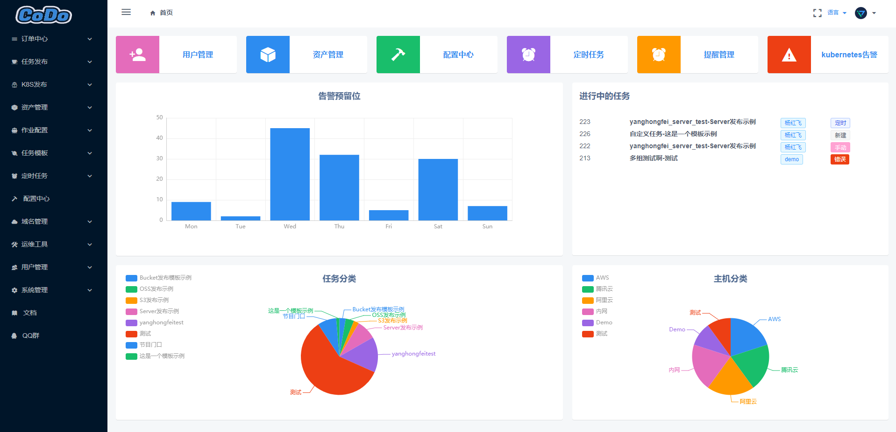

<p align="center">
    <a href="https://www.cortisdevops.cn/">
        
    </a>
</p>

[](README.md)
[](http://gitee.com/cortisdevops)
[](https://www.python.org/)
[](https://golang.google.cn/)
[](https://www.tornadoweb.org)
[](https://cn.vuejs.org)
[](https://ant-design.antgroup.com/)
[](https://www.iviewui.com/)
[](https://996.icu)
[](https://github.com/996icu/996.ICU/blob/master/LICENSE)

----

### 项目介绍

cortisdevops 是一款专为企业设计的开源全球一站式运维平台，支持多混合云环境和自动化运维，为企业提供跨地域、跨云的统一管理能力。

### 技术架构与优势

- **前端**：基于 Vue + iView 和 React + Ant Design 开发，提供直观友好的操作界面，显著提升用户体验和工作效率。
- **后端**：采用 Python Tornado 和 Golang Gin，具备轻量级、简洁清晰和异步非阻塞的特点，实现高并发和快速响应。
- **微服务网关**：基于 OpenResty + Lua，提供统一的 API 网关和服务治理能力，其优势在于高性能、灵活扩展和优秀的负载均衡支持。
- **微前端基座**：基于阿里乾坤框架，负责统一纳管前端应用，支持微前端架构，具备模块化管理、动态加载及高效集成的能力。

### 项目亮点

- **高效统一管理**：支持跨地域、跨云环境，简化多云资源运维。
- **可观测与智能化**：全面覆盖实时监控、预警与性能分析。
- **强大自动化能力**：一站式自动化工具提升运维效率，降低操作复杂性。
- **云原生支持**：优化容器化与微服务管理，为企业数字化转型赋能。

众多功能模块我们一直在不停的调研和开发，如果你对此项目感兴趣可以加入我们的社区交流群，

同时也希望你能给我们项目一个，为贡献者加油⛽️！为运维干杯🍻！

----

### 语言

[English](README_EN.md) | [中文](README.md)

### 产品架构


### 产品功能


### Demo

我们提供了Demo供使用者体验,可点击Try Online Demo快速进行体验。

<a href="https://demo.cortisdevops.cn/user/login" target="api_explorer">
  
</a>

`PS: Demo权限正在调试中，目前Demo用户只有查看权限，且暂不开放用户列表,Demo订单日志我们暂时清空了`

- 地址：https://demo.cortisdevops.cn/user/login
- 用户：demo
- 密码：2ZbFYNv9WibWcR7GB6kcEY



### 开始使用

> 当前版本支持docker compose和kubernetes helm 一键快速部署。

- [Document](https://docs.cortisdevops.cn/)
- [Quick Experience](https://demo.cortisdevops.cn/user/login)
- [Deployment Document](https://github.com/cortisdevops-cn/cortisdevops-deploy-docs)

### 视频教程

> 视频会在业余时间持续录制，更多视频可以参考Up主空间：https://space.bilibili.com/388245257/

- [部署安装教程](https://www.bilibili.com/video/BV1BL4y1a7TU/)
- [快速了解视频](https://www.bilibili.com/video/BV1rp4y1v7fa/)
- [二次开发教程](https://www.bilibili.com/video/BV1Sy4y137md/)

### 模块链接

> cortisdevops 项目我们是使用模块化、微服务化，以下为各个模块地址，同时也欢迎业界感兴趣各位大佬前来贡献

- 前端代码：[cortisdevops](https://github.com/cortisdevops-cn/cortisdevops)
- 管理后端：[cortisdevops-admin](https://github.com/cortisdevops-cn/cortisdevops-admin)
- 配置管理平台：[cortisdevops-cmdb](https://github.com/cortisdevops-cn/cortisdevops-cmdb)
- 任务调度：[cortisdevops-flow](https://github.com/cortisdevops-cn/cortisdevops-flow)
- 配置中心：[cortisdevops-kerrigan](https://github.com/cortisdevops-cn/kerrigan)
- 通知中心：[cortisdevops-notice](https://github.com/cortisdevops-cn/cortisdevops-notice)
- 灵云-kubernetes管理 ：[cortisdevops-cnmp](https://github.com/cortisdevops-cn/cortisdevops-cnmp)
- 管控中心 ：[cortisdevops-agent-server](https://github.com/cortisdevops-cn/cortisdevops-agent-server)
- 前端基座 ：[cortisdevops-home-index](https://github.com/cortisdevops-cn/cortisdevops-home-index)
- 天门网关 ：[cortisdevops-gateway](https://github.com/cortisdevops-cn/cortisdevops-gateway)

### 系统说明书

#### 系统定位

cortisdevops 面向企业运维和平台工程团队，提供一个统一的运维入口，用于纳管多云资源、业务资产、自动化任务、配置、通知、Kubernetes 集群和 Agent 节点。平台通过模块化和微服务化拆分，将用户权限、资源数据、任务编排、配置中心、通知中心、云原生管理和网关能力解耦，方便团队按模块独立部署、升级和扩展。

#### 使用对象

- **平台管理员**：负责应用接入、用户管理、角色权限、业务隔离和基础配置。
- **运维工程师**：负责 CMDB 资源维护、脚本执行、文件分发、流程编排、发布任务和故障处理。
- **研发团队**：通过标准化流程发起 CI/CD、发布审批、配置变更和日常作业。
- **业务负责人**：基于业务维度查看资源、流程、审批和告警通知。

#### 核心能力

- **统一入口**：通过前端基座和网关整合各业务模块，减少多系统切换成本。
- **权限与业务隔离**：基于应用、业务、接口权限、菜单权限和角色实现 RBAC 管理。
- **CMDB 资产管理**：维护业务树、云资产、主机、集群等资源数据，为自动化流程提供数据来源。
- **自动化工作流**：支持脚本执行、文件分发、接口编排、审批流程、定时任务和 CI/CD 场景。
- **配置中心**：集中管理业务配置，支持配置统一维护和下发。
- **通知中心**：对接审批、告警和流程结果通知，提高事件响应效率。
- **云原生管理**：支持 Kubernetes 多集群和云原生任务管理。
- **Agent 管控**：通过 cortisdevops-agent-server 和 cortisdevops-agent 管理节点连接、跨网络通道和主机任务执行。

#### 系统架构

```text
用户 / 浏览器
   |
   v
前端基座 cortisdevops-home-index / cortisdevops
   |
   v
天门网关 cortisdevops-gateway（OpenResty + Lua）
   |
   +-- cortisdevops-admin        用户、权限、应用、业务管理
   +-- cortisdevops-cmdb         CMDB、业务树、云资产管理
   +-- cortisdevops-flow         任务调度、脚本执行、流程编排
   +-- kerrigan          配置中心
   +-- cortisdevops-notice       通知中心
   +-- cortisdevops-cnmp         Kubernetes / 云原生管理
   +-- cortisdevops-agent-server Agent 管控中心
   |
   v
MySQL / Redis / RabbitMQ / Kubernetes / 云厂商资源 / 主机 Agent
```

#### 典型使用流程

1. **部署平台**：使用 Docker Compose 快速体验，或使用 Kubernetes Helm 部署生产环境。
2. **初始化账号**：创建管理后台超级用户，登录平台完成基础配置。
3. **配置组织与权限**：在 admin 中创建应用、业务、接口权限、菜单权限和角色。
4. **录入资源数据**：在 CMDB 中维护业务树、云资产、主机和集群资源。
5. **接入 Agent**：在需要执行主机任务或文件分发的环境中安装 cortisdevops-agent。
6. **编排自动化流程**：在 cortisdevops-flow 中配置脚本、凭证、接口、流程节点和审批规则。
7. **配置通知渠道**：在通知中心配置流程审批、任务结果和告警通知。
8. **持续运维**：通过工作台、任务中心、CMDB 和云原生管理模块完成日常运维。

#### 部署方式

- **Docker Compose 部署**：适合本地体验、Demo 和开发测试环境，参考 [Docker Compose 部署文档](docs/zh/guide-v2/2-install/docker.md)。
- **Kubernetes Helm 部署**：适合生产或类生产环境，参考 [Kubernetes Helm 部署文档](docs/zh/guide-v2/2-install/k8s.md)。
- **部署资源仓库**：完整部署脚本和参数示例参考 [cortisdevops-deploy-docs](https://github.com/cortisdevops-cn/cortisdevops-deploy-docs)。

#### 文档与二次开发入口

- 使用文档：[docs/zh/guide-v2/README.md](docs/zh/guide-v2/README.md)
- 架构说明：[docs/zh/guide-v2/1-architectures/README.md](docs/zh/guide-v2/1-architectures/README.md)
- Admin 权限管理：[docs/zh/guide-v2/3-admin/README.md](docs/zh/guide-v2/3-admin/README.md)
- CMDB 使用说明：[docs/zh/guide-v2/4-cmdb/README.md](docs/zh/guide-v2/4-cmdb/README.md)
- Flow 工作流说明：[docs/zh/guide-v2/5-cortisdevops-flow/README.md](docs/zh/guide-v2/5-cortisdevops-flow/README.md)
- 配置中心：[docs/zh/guide-v2/6-config-center/README.md](docs/zh/guide-v2/6-config-center/README.md)
- 通知中心：[docs/zh/guide-v2/7-notice/README.md](docs/zh/guide-v2/7-notice/README.md)
- 云原生管理：[docs/zh/guide-v2/8-cloud-native-management/README.md](docs/zh/guide-v2/8-cloud-native-management/README.md)

#### 运维注意事项

- 生产环境建议优先使用 Kubernetes Helm 部署，并将数据库、Redis、RabbitMQ 等中间件纳入统一备份和监控。
- 权限配置建议按“只读权限”和“管理权限”拆分，避免普通用户拥有过大的接口权限。
- 自动化脚本、凭证和发布流程需要通过业务维度隔离，并在上线前完成测试和审批。
- Agent 节点涉及跨网络通信和主机任务执行，应关注网络连通性、节点权限和任务审计。
- 文档站本身使用 VuePress 构建，可通过 `npm run build` 验证文档改动，不建议在本地随意执行 `npm run deploy`，该命令会发布到 GitHub Pages。

### 感谢贡献者

感谢以下贡献着为cortisdevops(cortisdevops)的贡献;
感谢各位的付出，让维护因你们变的不再枯燥、世界因你们而美丽，此排名不分前后，谢谢大家!

| Name                                          | Github Avatar                                                   | Name                                          | GitHub Avatar                                                    | Name                                              | Github Avatar                                                   |
|-----------------------------------------------|-----------------------------------------------------------------|-----------------------------------------------|------------------------------------------------------------------|---------------------------------------------------|-----------------------------------------------------------------|
| [laoxu](https://github.com/rootman-xjj)       |  | [shenshuo](https://github.com/ss1917)         |   | [laowang](https://github.com/cyancow)             |  |
| [yanghongfei](https://github.com/yanghongfei) |  | [shenyingzhi](https://github.com/shenyingzhi) |   | [biantingting](https://github.com/biantingting94) |  |
| [zhirenyongnan](https://github.com/Aaronzryn) |  | [libo](https://github.com/alexbolee)          |   | [liuchunyu](https://github.com/liuchunyu007)      |  |
| [ops-coffee](https://github.com/ops-coffee)   |  | [yangmingwei](https://github.com/yangmv)      |   | [punk](https://github.com/it-sos)                 |   |
| [radius2136](https://github.com/radius2136)   |  | [ccheers](https://github.com/ccheers)         |  | [Sean Chen](https://github.com/fengmengqiu)       |    |

**[⬆ 返回顶部](#产品架构)**

### QQ交流群

> 感兴趣的同学可以加入我们的QQ交流群,代码我们也会不断进行更新，感谢大家的支持。

-
一键加入QQ群：<a target="_blank" href="//shang.qq.com/wpa/qunwpa?idkey=69f5e118727c7ea925cc8d2f0eef0d729898cb8a24eae47e2b3ca3dd048de9d9"></a>

- 扫描二维码加群


## License

Everything is [GPL v3.0](https://www.gnu.org/licenses/gpl-3.0.html).


### 友情链接

[运维咖啡吧 - 一杯咖啡轻松运维](https://blog.ops-coffee.cn/)

[WeRSS - 微信公众号订阅助手](https://github.com/rachelos/we-mp-rss)


## 写在最后

感谢以下同学为Demo环境进行赞助。

| Name                                              | Github Avatar                                                   | 贡献金额  |
|---------------------------------------------------|-----------------------------------------------------------------|-------|
| [shenshuo](https://github.com/ss1917)             |  | ￥500  |
| [laowang](https://github.com/cyancow)             |  | ￥300  |
| [ops-coffee](https://github.com/ops-coffee)       |  | ￥300  |
| [yanghongfei](https://github.com/yanghongfei)     |  | ￥300  |
| [panda-yo](https://github.com/panda-yo)           |  | ￥200  |
| [yanshuanglong](https://github.com/yanshuanglong) |  | ￥200  |
| [Victor](https://github.com/victor)               |      | ￥200  |
| [DsinV](https://github.com/ywl913)                |   | ￥200  |
| [lixiaozheng](https://github.com/si7eka)          |  | ￥200  |
| [pcghost](https://github.com/q48775533q/)         |  | ￥100  |
| [ca7dEm0n](https://github.com/ca7dEm0n)           |  | ￥100  |
| [jiangming](https://github.com/jiangming1)        |  | ￥100  |
| [金额共计](https://github.com/cortisdevops-cn)          |  | ￥2700 |
